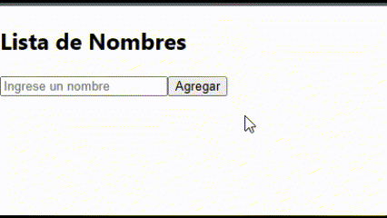

# Ejercicios de práctica
## Importante
Todas las entregas deben realizarse en el foro de tarea correspondiente en el campus de inove, salvo especificarse lo contrario.

## Preparar nuestro entorno de trabajo
Para poder realizar este ejercicio ya cuenta con el proyecto creado en esta carpeta de "ejercicios_practica". Utilizará esta carpeta para desarrollar todos los desafios de esta carpeta. Debe posicionar su terminal/consola dentro de la carpeta e instalar las dependencias antes de empezar:

`npm install`

## Consigna "NameList":
Implementa el componente "NameList" que muestre una lista de nombres y permita agregar nuevos nombres a la lista.

## Pasos para guiarte:

1. Crea un nuevo archivo llamado "NameList.jsx" y crea la funcion del componente con el mismo nombre.
2. Importa el hook `useState` desde React.
3. Dentro de la función NoteApp, declara dos useState()

```
const [names, setNames] = useState([]);
const [inputValue, setInputValue] = useState('');

```

- `names` es una variable de estado que almacenará las notas ingresadas por el usuario. Se inicializa como un arreglo vacío [].

- `setNames` es una función que se utilizará para actualizar el estado de la lista de nombre más adelante.

- `inputValue` es una variable de estado que almacenará el valor actual del campo de entrada de texto. Se inicializa como una cadena vacía ''.

- `setInputValue` es una función que se utilizará para actualizar el estado de inputValue más adelante.

4. Implementa la función `handleAddName`, que se llamará cuando el usuario haga clic en el botón "Agregar nombre":

```
const handleAddName = () => {
    if (inputValue.trim() !== '') {
        setNames([...names, inputValue]);
        setInputValue('');
    }
};
```

- La función `handleAddName` verifica si `inputValue` tiene contenido utilizando `trim()` para eliminar cualquier espacio en blanco al principio o al final.
- Si `inputValue` no está vacío, se crea una nueva matriz mediante el operador de propagación (...) que contiene todos los nombres existentes en `names`, seguido del valor actual de `inputValue`. Esta nueva matriz se pasa a `setNames()` para actualizar el estado de `names`.
- Luego, se establece `inputValue` como una cadena vacía `''` para borrar el campo de entrada de texto después de agregar un nombre.


6.  En el retorno del componente, crea la estructura HTML/JSX que representará la interfaz de usuario:

- Agrega un título `h2` con el texto "Lista de Nombres".
- Crea un campo de entrada de texto input con el atributo value establecido como `inputValue` y el evento `onChange` vinculado a una función que actualiza inputValue con el valor ingresado por el usuario.

```
 <input type="text" value={inputValue} onChange={(e) => setInputValue(e.target.value)} />
```

- Agrega un botón `button` con el texto "Agregar Nota" y el evento `onClick` vinculado a la función `handleAddName`.
- Crea una lista desordenada `ul` para mostrar los nombres ingresados.
- Utiliza el método `map()` en el arreglo notes para generar un elemento de lista `li` por cada nombre, pasando también el índice de cada nombre como segundo argumento a la función de mapeo.
- Dentro de cada elemento de lista, muestra el contenido del nombre.
- Asigna una clave key (key={}) única a cada elemento de lista utilizando el índice del nombre `index`.

7. Guarda el archivo "NameList.jsx".
8. Ahora puedes importar el componente "NameList" en el archivo "App.js" para poder renderizarlo.

## Resultado final

