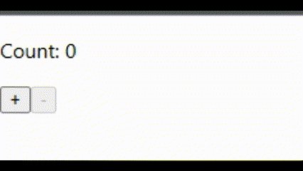

# Ejercicios de práctica
## Importante
Todas las entregas deben realizarse en el foro de tarea correspondiente en el campus de inove, salvo especificarse lo contrario.

## Preparar nuestro entorno de trabajo
Para poder realizar este ejercicio ya cuenta con el proyecto creado en esta carpeta de "ejercicios_practica". Utilizará esta carpeta para desarrollar todos los desafios de esta carpeta. Debe posicionar su terminal/consola dentro de la carpeta e instalar las dependencias antes de empezar:

`npm install`

## Consigna "Counter":
Crea un componente llamado "Counter". Este componente debe mostrar un contador en pantalla con los botones "+" y "-". El contador inicial debe ser 0 y el contador no puede ser menor a 0.

## Pasos para guiarte:

1. Crea un nuevo componente llamado "Counter.jsx".

2. Importa el hook `useState` desde la librería `react` en la parte superior del archivo.
3. Crea la función `Counter` que será el componente principal exportado por defecto.
4. Dentro de la función `Counter`, utiliza el hook `useState` para declarar una variable de estado llamada `count` con un valor inicial de `0`.
5. Crea dos funciones adicionales dentro de la función `Counter` llamadas `incrementCount` y `decrementCount` que se encargarán de incrementar y decrementar el valor del contador respectivamente.
6. Dentro del componente, utiliza JSX para renderizar el contador, los botones y agregar la funcionalidad de incrementar y decrementar.
7. En el botón de decremento, se agrega el atributo `disabled` y se asigna la expresión `{count < 1}` como su valor. Esto deshabilitará el botón cuando el valor del contador sea menor a 1, evitando que se disminuya por debajo de cero.

Una vez que hayas completado todos los pasos, el componente `Counter` debería estar listo para ser utilizado. Cuando el usuario haga clic en el botón "+" se incrementará el contador, y cuando haga clic en el botón "-" se decrementará, pero el botón "-" estará deshabilitado cuando el contador sea menor a 1 para evitar que sea menor a cero.

## Resultado final

