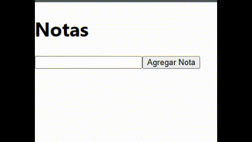

# Ejercicios de práctica
## Importante
Todas las entregas deben realizarse en el foro de tarea correspondiente en el campus de inove, salvo especificarse lo contrario.

## Preparar nuestro entorno de trabajo
Para poder realizar este ejercicio ya cuenta con el proyecto creado en esta carpeta de "ejercicios_practica". Utilizará esta carpeta para desarrollar todos los desafios de esta carpeta. Debe posicionar su terminal/consola dentro de la carpeta e instalar las dependencias antes de empezar:

`npm install`

## Consigna "NoteApp":
Implementa un componente de aplicación de notas. El componente debe permitir al usuario agregar y eliminar notas de una lista.

## Pasos para guiarte:

1. Inicia importando la función useState desde React en la parte superior del archivo.
2. Crea y exporta una función llamada NoteApp que será nuestro componente principal.
3. Dentro de la función NoteApp, declara dos useState()

```
const [notes, setNotes] = useState([]);
const [inputValue, setInputValue] = useState('');

```

- notes es una variable de estado que almacenará las notas ingresadas por el usuario. Se inicializa como un arreglo vacío [].

- setNotes es una función que se utilizará para actualizar el estado de notes más adelante.

- inputValue es una variable de estado que almacenará el valor actual del campo de entrada de texto. Se inicializa como una cadena vacía ''.

- setInputValue es una función que se utilizará para actualizar el estado de inputValue más adelante.

4. Implementa la función handleAddNote, que se llamará cuando el usuario haga clic en el botón "Agregar Nota":

```
const handleAddNote = () => {
  if (inputValue.trim() !== '') {
      setNotes([...notes, inputValue]);
      setInputValue('');
  }
};
```

- La función handleAddNote verifica si inputValue tiene contenido utilizando trim() para eliminar cualquier espacio en blanco al principio o al final.
- Si inputValue no está vacío, se crea una nueva matriz mediante el operador de propagación (...) que contiene todas las notas existentes en notes, seguido del valor actual de inputValue. Esta nueva matriz se pasa a setNotes() para actualizar el estado de notes.
- Luego, se establece inputValue como una cadena vacía '' para borrar el campo de entrada de texto después de agregar una nota.

5.  Implementa la función handleDeleteNote, que se llamará cuando el usuario haga clic en el botón "Eliminar" junto a una nota:

```
const handleDeleteNote = (index) => {
    const updatedNotes = [...notes];
    updatedNotes.splice(index, 1);
    setNotes(updatedNotes);
};

```

- La función handleDeleteNote toma un parámetro index que representa la posición de la nota que se desea eliminar.
- Dentro de la función, se crea una copia de la matriz notes utilizando el operador de propagación ... y se asigna a la variable updatedNotes. Esto asegura que no se modifique directamente el estado actual de notes.
- Se utiliza el método splice() de JavaScript para eliminar el elemento en la posición index de la matriz updatedNotes.
- Finalmente, se llama a setNotes() y se pasa updatedNotes como nuevo valor para actualizar el estado de notes y reflejar los cambios de eliminación de la nota en la interfaz de usuario.

6.  En el retorno del componente, crea la estructura HTML/JSX que representará la interfaz de usuario:

- Agrega un título h1 con el texto "Notas".
- Crea un campo de entrada de texto input con el atributo value establecido como inputValue y el evento onChange vinculado a una función que actualiza inputValue con el valor ingresado por el usuario.

```
 <input type="text" value={inputValue} onChange={(e) => setInputValue(e.target.value)} />
```

- Agrega un botón button con el texto "Agregar Nota" y el evento onClick vinculado a la función handleAddNote.
- Crea una lista desordenada ul para mostrar las notas ingresadas.
- Utiliza el método map() en el arreglo notes para generar un elemento de lista li por cada nota, pasando también el índice de cada nota como segundo argumento a la función de mapeo.
- Dentro de cada elemento de lista, muestra el contenido de la nota y agrega un botón "Eliminar" con el evento onClick vinculado a una función anónima que llama a handleDeleteNote pasando el **índice** de la nota.
- Asigna una clave key (key={})única a cada elemento de lista utilizando el índice de la nota.

## Resultado final

