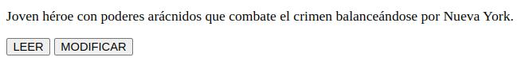
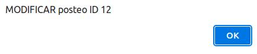

# MiBlog React

## Contexto
Para este desafio tenemos como propósito construir una aplicación de "Blog" la cual estará basado en el backend "miblog":

[miblog backend](https://miblog.inovecode.com/docs)

- A lo largo del curso irá agregando funcionalidades a su Blog hasta tenerlo completo al final del curso, como una aplicación completa basada en los conceptos vistos en la cursada.
- Para ello usted tendrá su propio repositorio el cual utilizará y mantendrá actualizado con cada nuevo desafio de profundización.
- En caso de tener dudas o problemas, nos compartirá el link del repositorio para poder ayudarlo u orientarlo.


## Esquema de la aplicación
Esta aplicación permitirá:
- Logearse con un usuario
- Ver los posteos de ese usario
- Leer un posteo de un usuario
- Modificar el posteo de un usuario
- Crear un nuevo posteo para un usuario

Todas estas funcionalidades las construiremos a lo largo de la cursada con cada nuevo desafio. En cada desafio se dará detalle del paso siguiente a realizar.


## Importante
Aún no hemos visto como integrar CSS en React, no se preocupe que más adelante llegará el momento de agregar estilos a su aplicación.


## Consiga
1. Deberá comenzar por crear un repositorio nuevo para alojar este proyecto. En el deberá crear un proyecto de React utilizando npm.
2. Deberá renderizar una lista de posteos utilizando map. Para eso deberá crear una variable array con los datos de los siguientes 5 posteos:
```js
[
  {
    "id": 12,
    "titulo": "Spiderman",
    "texto": "Joven héroe con poderes arácnidos que combate el crimen balanceándose por Nueva York.",
    "user_id": 7,
    "usuario": "stan_lee"
  },
  {
    "id": 14,
    "titulo": "X-MEN",
    "texto": "Equipo de mutantes con habilidades únicas que luchan por la coexistencia pacífica entre humanos y mutantes.",
    "user_id": 7,
    "usuario": "stan_lee"
  },
  {
    "id": 16,
    "titulo": "Capitán América",
    "texto": "Soldado mejorado con un escudo indestructible que lidera a los Vengadores en la defensa del mundo.",
    "user_id": 7,
    "usuario": "stan_lee"
  },
  {
    "id": 17,
    "titulo": "Thanos",
    "texto": "Titán obsesionado con el poder y las Gemas del Infinito, busca la aniquilación para equilibrar el universo.",
    "user_id": 7,
    "usuario": "stan_lee"
  },
    {
    "id": 18,
    "titulo": "Ant-Man",
    "texto": "Héroe capaz de encogerse y controlar insectos con un traje especial para combatir el mal.",
    "user_id": 7,
    "usuario": "stan_lee"
  },
]
```

Por cada uno de estos posteos deberá armar una "tarjeta" (card) que contenga el título del posteo y dos botones (un botón de "leer" y otro botón de "modificar")

Un aproximado de como podría verse cada uno de esos posteos en su página:




3. Es muy importante que en la renderización por map utilice el id del posteo (que varía de posteo a poste) disponibles en el array como "key" de cada elemento.

4. Cuando el botón LEER o MODIFICAR sea presionado, deberá lanzar un cartel con "alert" que muestre la acción a realizar y el ID del posteo. Por ejemplo para el caso del posteo de Spiderman:

"MODIFICAR posteo ID 12"

